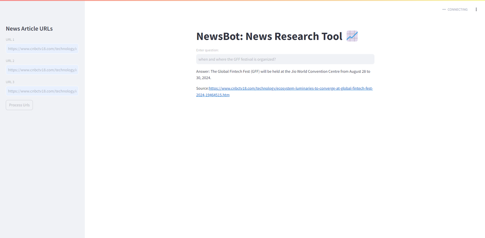
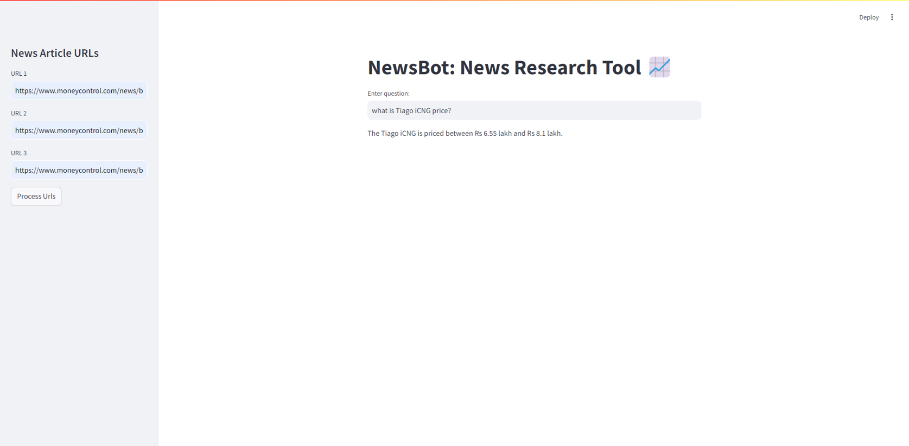

# News_Search_Tool_using_LLM

The news_search_tool is a powerful and efficient application designed to retrieve news articles quickly using the Mistral 7B OpenOrca GGUF model. This tool delivers precise search results within 5 to 6 minutes on a local computer, utilizing 16 GB of VRAM and RAM. To further enhance performance, GPU offloading techniques are applied, significantly increasing inference speed.

The system is built on a Retrieval-Augmented Generation (RAG) framework, which integrates a Qdrant vector database to store and query news data. Qdrant is known for its high-quality features, including:

-> Scalable Vector Storage: Handles large volumes of high-dimensional vectors with efficiency. <\br>
-> Fast Similarity Search: Provides quick and accurate search results through advanced indexing and querying capabilities.  
-> Flexible and Robust: Supports dynamic updates and scaling, ensuring the database remains responsive and reliable as data grows.  

In the development process, various models such as Phi-3-4k Instruct and Llama-2-Chat-HF were tested. The Mistral 7B model outperformed these alternatives, delivering the best results in terms of accuracy and relevance. This combination of Mistral 7B's capabilities and Qdrant's robust vector database ensures users receive high-quality, timely information with exceptional speed and precision.

